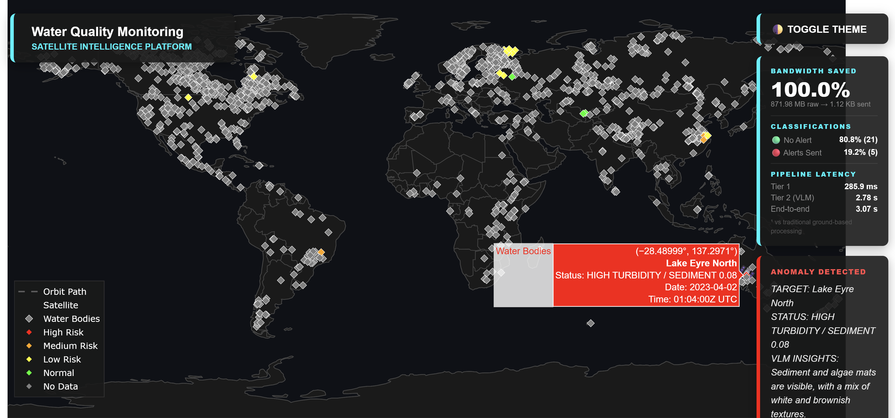

# Liquid Lens 
> On-board Water Quality Monitoring



---
 
## The Problem
 
Satellites generate terabytes of multi-spectral imagery per pass, but a small-sat's
downlink budget is limited. Raw imagery cannot fit. Under the
traditional approach, data queues until a ground station appears, then waits again
for inferencing and analyst review - a process that can take hours or days. By the time an algal bloom
or turbidity spike reaches a decision-maker, it has already spread.
 
## The Solution
 
Liquid Lens moves the decision on-board. A two-tier inference pipeline runs directly
on the satellite:
 
- **Tier 1 - Spectral Math:** Four spectral indices (NDWI for water presence, NDTI
  for turbidity, NDCI for algae, NIR absorption for depth) classify every observation, 
  with no GPU required. The majority of observations are normal and require no downlink traffic.
- **Tier 2 - Vision Model (conditional):** Only when Tier 1 flags a medium or high
  risk anomaly does Liquid AI's LFM2.5-VL-450M activate. It visually confirms the
  spectral finding and generates a natural-language explanation - turbidity plumes,
  algae mats, exposed lake beds - ready to transmit as a compact alert.
The result is global lake monitoring at small-sat cost, with actionable alerts
produced in seconds from the moment the satellite is overhead.
 
## Architecture
 
```
SimSat API (:9005)
      │  multi-spectral bands: green · red · NIR · red-edge
      ▼
 collect_data.py
  ├─ Tier 1: Spectral indices (NDWI / NDTI / NDCI / NIR)
  │          no GPU required · filters normal passes
  │
  └─ Tier 2: LFM2.5-VL-450M via llama-server (:8080)
             triggered only on high / medium risk
             produces natural-language anomaly description
      │
      ▼
 shared_state.json  ──►  Flask app (:5000)  ──►  Plotly globe dashboard
                         live satellite position · risk level · VLM insight  
```
 
---

## Requirements

- Docker & Docker Compose (v2)
- wget, unzip (for setup script)
- ~500 MB free disk space for model weights (downloaded by setup script)
- Additional disk space in `data/` grows with simulation time as captured
spectral images are saved per lake per pass
- **SimSat** (DPhi Space simulator) — must be running before starting Liquid Lens (see step 1 below)

---

## Quick Start

### Step 1: Start SimSat

```bash
git clone https://github.com/DPhi-Space/SimSat
cd SimSat
docker-compose up
```

Leave this running. 
- **Dashboard**: http://localhost:8000 
- **API**: http://localhost:9005

### Step 2: Clone this repo and download assets

```bash
git clone https://github.com/LiquidLensSystems/water-vlm
cd water-vlm
chmod +x setup.sh
./setup.sh
```

This downloads the LFM2.5-VL model weights (~500 MB) and the Natural Earth
lakes shapefile into `models/` and `data/` respectively.

### Step 3: Start llama-server on the host
 
llama-server runs directly on the host so it can access CPU/GPU backends.
Open a dedicated terminal and leave it running:
 
```bash
cd llama-b7633
./llama-server \
  -m ../models/LFM2.5-VL-450M-Q4_0.gguf \
  --mmproj ../models/mmproj-LFM2.5-VL-450m-F16.gguf \
  -c 8192 \
  --port 8080 \
  -ngl 99
```
 
Use `-ngl 0` if you do not have a GPU. Wait for `llama server listening` before
proceeding.

### Step 4: Start Liquid Lens

```bash
docker-compose up --build
```

- **Dashboard**: http://localhost:5000
- **llama-server**: http://localhost:8080

---

## Repository Layout

```
water-vlm/
├── event_radar/
│   ├── collect_data.py          # Satellite loop + tiered inference
│   └── mission_control/
│       ├── app.py               # Flask dashboard backend
│       └── templates/
│           └── index.html       # Plotly globe frontend
├── llama-b7633/                 # llama.cpp b7633 binaries (run on host)
├── docs/
│   └── dashboard.png            # Dashboard screenshot
├── models/                      # Downloaded by setup.sh (git-ignored)
├── data/                        # Shapefile + captured images (git-ignored)
├── docker-compose.yml
├── Dockerfile.app
├── requirements.txt
└── setup.sh
```

---

## Notes

- `network_mode: host` is used so all services can reach SimSat at `localhost:9005`
  and llama-server at `localhost:8080` without extra network configuration.
  This works on Linux and WSL2. It does **not** work on macOS Docker Desktop.
- llama-server runs on the host directly to ensure CPU/GPU backends load correctly.
- Model weights and captured data are git-ignored. Run `setup.sh` before first use.
- Always use `docker compose down -v` (not just `docker compose down`) when
  restarting after frontend changes, to ensure the volume is refreshed.
